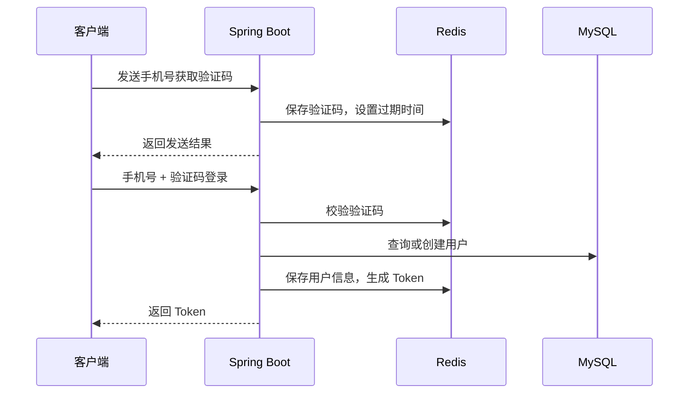
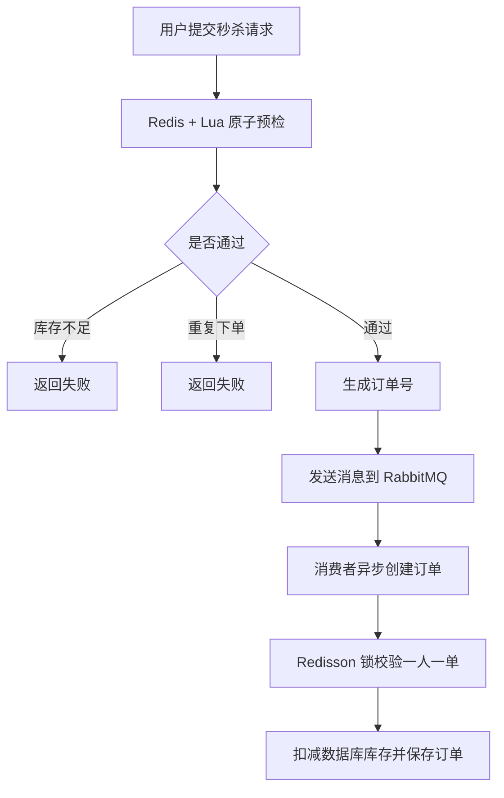

# 黑马点评后端项目

> 本项目基于黑马点评课程项目进行学习与二次整理，主要用于展示 Redis 高并发场景下的缓存、秒杀、分布式锁、消息队列等后端能力。

## 项目简介

黑马点评是一个类似大众点评的本地生活服务后端项目，围绕用户登录、商户查询、优惠券秒杀、探店笔记、点赞排行、好友关注、附近商户、用户签到等业务展开。

项目重点不在页面展示，而在后端高并发场景的处理：使用 Redis 承载登录态、缓存热点数据、完成秒杀资格预检，并结合 Lua、RabbitMQ、Redisson、MyBatis-Plus 等组件解决缓存一致性、超卖、一人一单、异步下单等问题。

## 技术栈

| 分类 | 技术 |
| --- | --- |
| 后端框架 | Spring Boot 2.3.12.RELEASE |
| 数据访问 | MyBatis-Plus, MySQL |
| 缓存与分布式能力 | Redis, Redisson, Lua |
| 消息队列 | RabbitMQ |
| 工具库 | Lombok, Hutool |
| 构建工具 | Maven |
| JDK | Java 8 |

## 核心功能

- 短信验证码登录：使用 Redis 保存验证码和用户登录态，用 Token 替代 Session。
- 登录拦截：通过两层拦截器完成 Token 刷新、用户信息保存、登录权限校验。
- 商户缓存：实现商户详情缓存，降低数据库访问压力。
- 缓存问题处理：包含缓存穿透、缓存击穿、缓存雪崩的处理思路和实现。
- 优惠券秒杀：使用 Redis + Lua 做库存和一人一单资格预检。
- 异步下单：秒杀请求通过 RabbitMQ 异步落库，削峰填谷。
- 分布式锁：使用 Redisson 处理集群环境下的一人一单并发问题。
- 附近商户：使用 Redis GEO 查询附近商户并按距离排序。
- 探店互动：支持探店笔记、点赞、点赞排行、关注、共同关注。
- 用户签到：使用 Redis Bitmap 记录签到并统计连续签到天数。

## 架构流程

### 登录流程



### 秒杀下单流程



## 项目结构

```text
src/main/java/com/hmdp
├── config          # Web、MyBatis、RabbitMQ、Redisson 配置
├── controller      # 接口层
├── dto             # 接口返回与请求对象
├── entity          # 数据库实体
├── interceptor     # 登录拦截器
├── listener        # RabbitMQ 消费者
├── mapper          # MyBatis-Plus Mapper
├── service         # 业务接口
├── service/impl    # 业务实现
└── utils           # Redis、缓存、分布式锁等工具类

src/main/resources
├── application.yaml
├── db/hmdp.sql
├── mapper/VoucherMapper.xml
├── seckill.lua
└── unLock.lua
```

## 运行环境

建议本地准备以下环境：

- JDK 8
- Maven 3.6+
- MySQL 5.7 或 8.x
- Redis 5+
- RabbitMQ 3.x

## 本地启动

1. 创建数据库并导入 SQL。

```sql
CREATE DATABASE hmdp DEFAULT CHARACTER SET utf8mb4 COLLATE utf8mb4_general_ci;
USE hmdp;
SOURCE src/main/resources/db/hmdp.sql;
```

也可以使用 Navicat、DataGrip 等工具直接导入：

```text
src/main/resources/db/hmdp.sql
```

2. 修改本地配置。

配置文件位置：

```text
src/main/resources/application.yaml
```

重点确认以下配置和本地环境一致：

```yaml
spring:
  datasource:
    url: jdbc:mysql://127.0.0.1:3306/hmdp?useSSL=false&serverTimezone=UTC&allowPublicKeyRetrieval=true
    username: root
    password: 你的本地 MySQL 密码

  redis:
    host: 127.0.0.1
    port: 6379

  rabbitmq:
    host: localhost
    port: 5672
    username: guest
    password: guest
```

3. 启动依赖服务。

需要先启动 MySQL、Redis、RabbitMQ，再启动 Spring Boot 项目。

4. 启动后端服务。

```bash
mvn spring-boot:run
```

默认端口：

```text
http://localhost:8081
```

## 常用接口

| 功能 | 方法 | 路径 |
| --- | --- | --- |
| 发送验证码 | POST | `/user/code` |
| 登录 | POST | `/user/login` |
| 当前用户 | GET | `/user/me` |
| 用户签到 | POST | `/user/sign` |
| 连续签到统计 | GET | `/user/sign/count` |
| 商户详情 | GET | `/shop/{id}` |
| 按类型查询商户 | GET | `/shop/of/type` |
| 新增优惠券 | POST | `/voucher` |
| 新增秒杀券 | POST | `/voucher/seckill` |
| 秒杀下单 | POST | `/voucher-order/seckill/{id}` |
| 发布探店笔记 | POST | `/blog` |
| 点赞探店笔记 | PUT | `/blog/like/{id}` |
| 热门笔记 | GET | `/blog/hot` |
| 关注用户 | PUT | `/follow/{id}/{isFollow}` |
| 共同关注 | GET | `/follow/common/{id}` |

登录后访问需要权限的接口时，请在请求头中携带 Token：

```text
authorization: 登录接口返回的 token
```

## Redis 设计要点

| 场景 | Redis 数据结构 / 技术点 |
| --- | --- |
| 验证码 | String，短 TTL |
| 登录态 | Hash，Token 作为 Key |
| 商户缓存 | String + JSON |
| 缓存击穿 | 互斥锁、逻辑过期 |
| 秒杀资格预检 | Lua 脚本保证原子性 |
| 一人一单 | Set 记录用户下单资格 |
| 点赞排行 | ZSet |
| 好友关注 | Set |
| 附近商户 | GEO |
| 用户签到 | Bitmap |
| 全局 ID | Redis 自增序列 |

## 简历描述参考

黑马点评后端项目基于 Spring Boot、MySQL、Redis、RabbitMQ 实现本地生活服务核心业务。项目中使用 Redis 解决分布式 Session、商户缓存、附近商户、签到统计、点赞排行等场景；针对缓存穿透、击穿、雪崩实现空值缓存、互斥锁、逻辑过期等方案；秒杀模块使用 Redis + Lua 完成库存和一人一单资格预检，并结合 RabbitMQ 异步下单、Redisson 分布式锁和数据库乐观扣减库存，降低高并发下的超卖和重复下单风险。

## 当前待优化项

以下是把项目作为 GitHub 简历展示时建议继续整理的点：

- `application.yaml` 中本地数据库密码需要改成自己的本地配置，公开仓库不建议提交真实密码。
- `RedissonConfig` 当前 Redis 地址写死为 `127.0.0.1:6379`，后续可改为读取 `application.yaml`。
- `SystemConstants.IMAGE_UPLOAD_DIR` 当前是 Windows 本地路径，后续可改为配置项。
- 部分 Java 源码注释存在编码显示异常，建议统一为 UTF-8 后再提交。
- 部分未使用 import 和实验代码可以继续清理，提升代码观感。
- 当前目录尚未初始化 Git 仓库，提交 GitHub 前需要先执行 `git init` 并提交首个版本。

## 说明

本项目用于学习和简历展示，重点展示 Redis 在高并发业务中的应用。若用于正式生产环境，还需要补充配置隔离、异常补偿、接口鉴权、统一日志、监控告警、自动化测试和部署脚本等工程能力。
